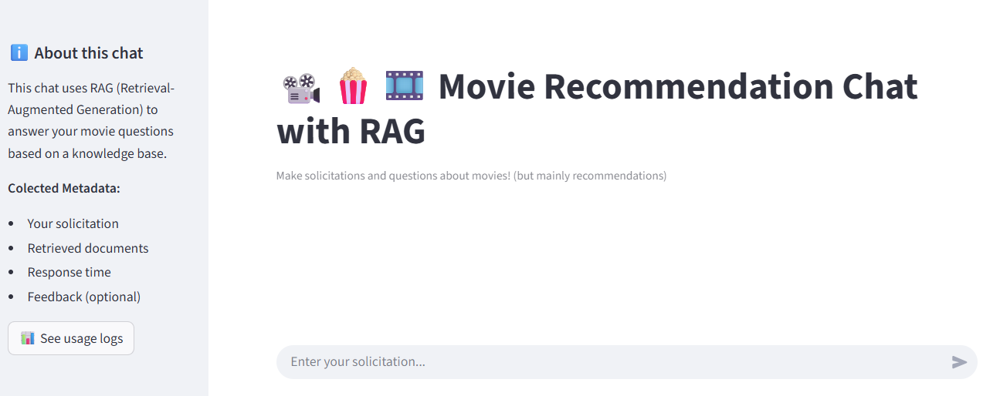
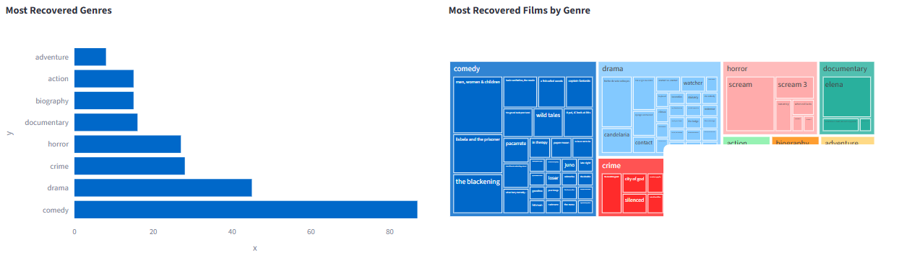
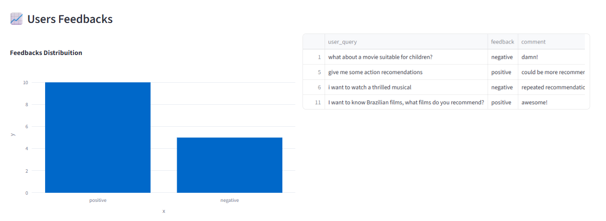

# 🎬 Movie Recommendation Chat - RAG System


This project develops a complete **Retrieval-Augmented Generation (RAG)** system for movie recommendations, featuring an interactive chat interface and comprehensive monitoring dashboard.



> **🤔 What is RAG?** RAG combines information retrieval with AI generation - it first searches a knowledge base for relevant information, then uses that context to generate intelligent responses!

## 🎯 Project Overview

* **📥 Data Extraction**: Download movie metadata and plots from OMDb API
* **🔄 Data Preparation & Embedding**: Transform structured data into vector representations
* **🧠 RAG Modeling**: Enhance ChatGPT with movie knowledge base
* **💰 Cost Simulation**: Estimate API expenses before deploying new models
* **💬 User Interface**: Friendly chat interface for movie recommendations
* **📊 Monitoring**: Real-time performance analytics and user feedback
* **🐳 Deployment**: Containerized deployment using Docker

## 🛠️ Tools used

* **🐍 Conda** - Virtual environment management
* **🔍 Pylint** - Static code analysis for quality control
* **✅ pre-commit** - Automated code quality checks before commits
* **🎬 OMDb API** - Movie database for plot and metadata
* **🔮 Qdrant** - Vector database for semantic search
* **🤖 OpenAI API** - GPT models for conversational AI
* **⚡ FastAPI** - High-performance API framework
* **📈 Streamlit** - Chat UI and monitoring dashboard

## 📁 Projet Struture

``` bash
.
├── Makefile                         # Automation scripts for common tasks
├── README.md                        # Project documentation
├── api                              # FastAPI backend service
│   ├── Dockerfile                   # Container configuration for API
│   └── api.py                       # Main API endpoints and RAG integration
├── data                             # Data storage directories
│   ├── processed                    # Cleaned and transformed data
│   └── raw                          # Original extracted data from APIs
├── docker-compose.yaml              # Multi-service container orchestration
├── evaluation                       # Performance testing and validation
│   ├── __init__.py
│   ├── generate_evaluation_data.py  # Creates test datasets for RAG evaluation
│   ├── rag.py                       # RAG implementation for tests
│   ├── rag_eval.py                  # End-to-end RAG system evaluation
│   ├── retrieval_eval.py            # Vector search performance metrics
│   └── simulate_cost.py             # Usage cost estimation method
├── logs                             # Application logging
│   ├── chat                         # User conversation history and feedbacks
│   └── system                       # Application and error logs
├── monitoring                       # Analytics and monitoring dashboard
│   ├── Dockerfile                   # Container config for monitoring service
│   ├── dashboard.py                 # Streamlit performance dashboard
├── requirements.txt                 # Python dependencies
├── src                              # Core application logic
│   ├── Dockerfile                   # Container config for core services
│   ├── __init__.py
│   ├── create_qdrant_collection.py  # Vector database setup and population
│   ├── data_extractor.py            # Movie data extraction from OMDb API
│   ├── rag_engine.py                # Main RAG orchestration engine
│   └── vector_search.py             # Qdrant vector search operations
└── ui                               # User interface components
    ├── Dockerfile                   # Container config for chat interface
    └── chatbot.py                   # Streamlit chat application
```

## 🔄 RAG Pipeline Flow

### 🎯 Step-by-Step Process

1. **🔮 Vector Database Creation**
   - Create Qdrant collection with multiple search capabilities:
   - **🔍 Semantic Search**: Understands meaning and context
   - **📐 Vector Search**: Mathematical similarity matching
   - **🤝 Hybrid Search**: Combines both approaches
   - *All movie plots are converted into numerical vectors (embeddings)*

> **🔍 What are embeddings?** They're numerical representations of text that capture semantic meaning, allowing computers to understand relationships between words and concepts!

2. **🎯 Query Processing**
   - User request is transformed into the same vector space
   - TOP_K most similar movies are retrieved using similarity metrics

3. **🧠 Contextual Response Generation**
   - Selected movie information is formatted into a prompt template
   - ChatGPT generates responses using ONLY the provided context
   - Prevents hallucination and ensures accuracy

### 🌐 Deployment Pipeline

1. **🔌 API Hosting**: RAG system deployed as scalable API
2. **💬 Chat Interface**: User-friendly chatbot deployment
3. **📝 Feedback Collection**: Users can rate responses and provide comments


## 📊 Evaluation & Model Selection

### 🧪 Testing Methodology

To select the optimal retrieval method, I conducted comprehensive evaluations comparing:

* **🔍 BM25** - Traditional keyword-based search
* **📐 Vector Search** - Pure semantic similarity
* **🤝 Hybrid Search** - Combined approach

**Parameters Tested**: K values of 5, 10, and 15 documents

### 📈 Evaluation Framework

**Ground Truth Dataset**:
- Created with AI assistance: 3 questions per movie
- Available in repository for reproducibility
- Includes cost simulation for custom dataset generation

### 🏆 Performance Metrics

**HitRate**: Percentage of queries where correct answer is in top results
**MRR (Mean Reciprocal Rank)**: Measures how high correct answers rank in results

**📊 Results Summary**:
- **Hybrid performed best** within the bigger K values
- **K=10 selected** as optimal (minimal improvement with K=15)

| Method  | HitRate@5 | MRR@5 | HitRate@10 | MRR@10 | HitRate@15 | MRR@15 | Selected |
|-|-|-|-|-|-|-|-|
| Semantic | 0.7199 | 0.5940 |  0.7918 | 0.6036 | 0.8254 | 0.6062| |
| BM25 | **0.8543** | **0.7872** | 0.8908 | 0.7921 |  0.9048 | 0.7932 | |
| **Hybrid**  | 0.8506 | 0.7844 | **0.8945** | **0.8040** | **0.9104** | **0.7986** |✅ |

#### 🧠 LLM Evaluation & RAG Impact Analysis

**Evaluation Methodology:**
After selecting the retrieval method, I conducted a comprehensive comparison between the RAG-enhanced chat and the baseline chat (without RAG capabilities) using the same evaluation dataset.

**Evaluation Process:**
- Used the LLM itself to classify each response into three categories:
  - **"NON_RELEVANT"** - Incorrect or irrelevant recommendations
  - **"PARTLY_RELEVANT"** - Partially correct but incomplete answers
  - **"RELEVANT"** - Accurate and appropriate recommendations
- Implemented additional validation steps to verify movie name accuracy, particularly important for recent films where the base model's knowledge is limited
- **Primary metric:** Percentage of "RELEVANT" classifications

**Key Findings:**
- **📈 Improvement**: RAG system increased relevant responses by 20 percentage points
- **🎯 Enhanced Capabilities**:
  - **RAG System**: Successfully recommends recent releases and non-American cinema beyond the model's original training data
  - **Base Chat**: It still performed better than RAG in recommending films by a specific director
- **🌍 Expanded Coverage**: RAG effectively bridges the knowledge gap for content outside the model's cutoff date and regional focus

| Prompt Strategy       | NON_RELEVANT | PARTLY_RELEVANT | RELEVANT | Selected |
|-----------------------|------------|-----------|---------|----------|
| Raw chat | 0.0373    | 0.2577   | 0.7050  | |
| RAG      | **0.0513**   | **0.0401**  | **0.9085**    | ✅ |

## 🚀 How to Execute Locally

Run the complete RAG movie recommendation system with the following commands:

### 📋 Prerequisites

* Makefile
* Conda
* Docker
* Qdrant

### ⚙️ Project Setup with Makefile

1. Create and activate enviroment
``` bash
make setup
```

2. Activate enviroment
``` bash
source ~/.bashrc && conda activate chat-env
```

3. Install dependencies and pre-commit hooks
``` bash
make install
```

### 🔐 Configure Credentials

Create your environment file from the template:
``` bash
cp .env.example .env
```
1. **OMDb API** (Optional) - Get credentials from [OMDb Website](https://www.omdbapi.com/apikey.aspx)
2. **OpenAI API** - Obtain API keys from [OpenAI Platform](https://platform.openai.com/)
3. **Model Parameters** - Customize embedding model, GPT model, and TOP_K values in `.env`

### **RUN**

``` bash
make complete-chat-flow
```

#### 🌐 Service Access Points

After all those commands are runned, you can access the services below

| Service | URL | Purpose |
|---------|-----|---------|
| **Qdrant Dashboard** | http://localhost:6333/dashboard | Vector database management |
| **FastAPI Docs** | http://localhost:8000/docs | API documentation & testing |
| **Chat Interface** | http://localhost:8501 | Main chatbot UI |
| **Monitoring Dashboard** | http://localhost:8502 | Performance analytics |

### 🔌 FastAPI Integration

Test the RAG system directly via API:

```bash
curl -X POST "http://localhost:8000/rag/query" \
  -H "Content-Type: application/json" \
  -d '{"query": "I want comedy movies for quiet people", "top_k": 10}'
```

### 💬 Chat Interface Features

The Streamlit chatbot includes:
- **Feedback system** with thumbs up/down ratings
- **Optional comment field** for detailed feedback
- **Automatic logging** of all interactions
- **Session management** for conversation history

#### 📝 Logging Formats

**Chat Logs** (`logs/chat/chat_logs.jsonl`):
```json
{
  "timestamp": "2024-01-01T12:00:00",
  "session_id": "unique_session_id",
  "user_query": "Find movies about artificial intelligence",
  "retrieved_documents": [...],
  "retrieved_count": 10,
  "llm_response": "Based on your query, I recommend...",
  "response_time_seconds": 2.34,
  "context_used": ["Ex Machina", "Her", "Blade Runner", ...],
  "average_similarity": 0.85
}
```

**Document Metadata** (shown in retrieved_documents key):
```json
{
  "title": "Inception",
  "year": 2010,
  "origin": "USA",
  "director": "Christopher Nolan",
  "cast": "Leonardo DiCaprio, Ellen Page",
  "genres": "Action, Sci-Fi, Thriller",
  "similarity_score": 0.92,
  "content_preview": "A thief who steals corporate secrets..."
}
```

**User Feedback**  (`logs/chat/feedback_logs.jsonl`):
```json
{
  "timestamp": "2024-01-01T12:05:00",
  "user_query": "Find movies about artificial intelligence",
  "llm_response": "Based on your query, I recommend...",
  "feedback": "positive",
  "comment": "Great recommendations, exactly what I wanted!"
}
```

By the way, I kept the feedback data I generated during my testing.

### 📊 Monitoring Dashboard

The monitoring system provides real-time insights:
- **Response time** analysis
- **Similarity scores** between queries and context
- **Retrieval analytics** - movies and genres retrieved
- **User feedback** trends and satisfaction rates
- **Performance metrics** over time





### 🔚 Shutdown Procedures

After using the application:

1. **Stop Docker services**:
```bash
docker-compose down -v
```

2. **Deactivate Conda environment**:
```bash
conda deactivate
```
## 🔧 Custom Implementation Guide

To adapt the project with your own data or models:

### 🗃️ Data Extraction (Optional)

Replace the default dataset with your Letterboxd ratings:
1. Export your ratings from Letterboxd (`ratings.csv`)
2. Replace `data/raw/ratings.csv` with your file
3. Extract movie metadata:

```bash
make extract-data
```

### 🐳 Docker Deployment

Build and start all services:

```bash
docker-compose up --build -d
```

### 🔮 Vector Database Setup

Create and populate Qdrant collections:

```bash
make create-qdrant-collections
```

### 🧪 Evaluation Pipeline

1. **Cost simulation** (estimate API expenses):
```bash
make generate-evaluation-data-simulation
```

3. **Generate evaluation data** (regenerate for custom datasets):
```bash
make generate-evaluation-data
```

3. **Retrieval evaluation**:
```bash
make retrieval-eval
```

4. **RAG system evaluation**:
```bash
make rag-eval-simulation  # Cost estimation
make rag-eval             # Full evaluation
```

### 🚀 Service Execution

**Start FastAPI**:
```bash
make api
```

**Launch Chat Interface**:
```bash
make chatbot
```

**Open Monitoring Dashboard**:
```bash
make monitor
```

### 🛑 Clean Shutdown

```bash
docker-compose down -v
conda deactivate
```

## Acknowledgments

Thank you to [DataTalks.club](https://datatalks.club/) for the excellent LLM Zoomcamp and for proposing this project. The hands-on approach provided invaluable experience in building a complete RAG system from scratch.

## Author

Built with ❤️ by **Laura Alexandria de Oliveira**

